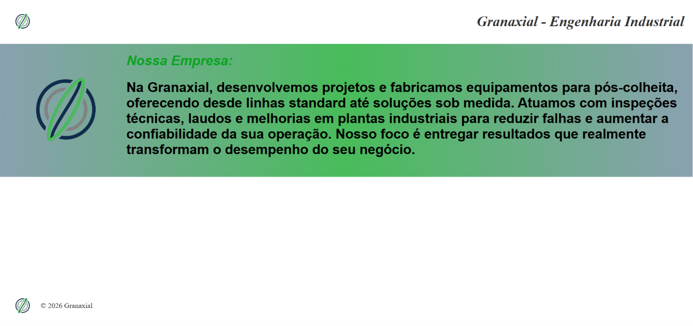
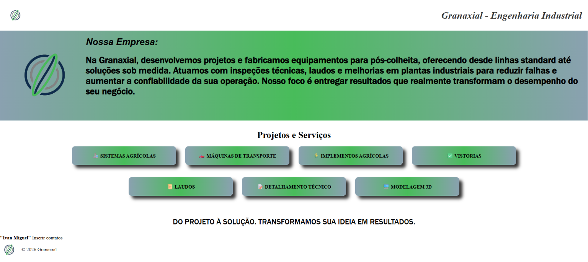

# 🏗️ Granaxial 
Repositório para Site da empresa Granixia

    

<strong> [Acessar site](https://estevanmensan.github.io/Granaxial/) <strong>

## 📰 Planejamento do site
- Criação da arquitetura do site
- Modelagem baseado em site real
- Apenas uma páginaS
- Linguagem: HTML, CSS, JS

## 💻 Updates do site 
- Abertura da página (GitHub.pages)
- Atualizações do Header e Footer (cabeçalho e rodapé)
- Adição de 'conteiner' informando sobre a empresa
- Adicionados cards dos serivços da empresa
- Atualização da cor da fonte no header "Nossa Empresa"
- Adição de aba de contato
- Slogan também foi adicionado

## 💡 Adições a page
<strong> Nota: As ideias das adições que forem implementadas efetivamente na página serão removidas deste tópico e adicionadas ao tópico "Updates do site". </strong>
- ~~Conteiner com os serviçoes prestados pela empresa~~
- Conteiner para contatos (Em andamento)
- Estudar possibilidades de estilização do site <strong>(Quando identificadas, descreve-las aqui!) </strong>
- Estilizar o conteiner do slogan
- Possibilidade de utilizar uma imagem de background no header

## 🖨️ Print da página

    <strong>Espaço reservado para prints do estado atual da página-Será inserido juntamente com datas para melhor descrição das atualizações.</strong>

    
    
Pagina data: 13_05_2026

    
    
Pagina data: 14_05_2026

